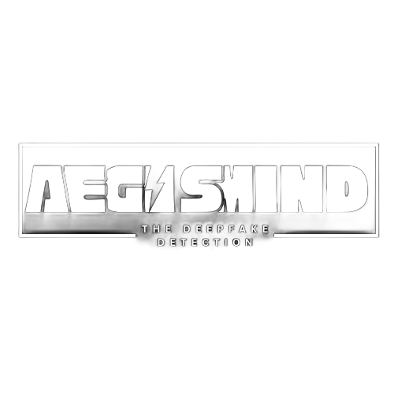

# 🧠 AEGISMIND  
### Advanced Deepfake Detection System (v2.0)  
**“Detect the unreal — Protect the real.”**

---

---

## 🚀 Overview
AEGISMIND is a next-generation **Deepfake Detection Platform** capable of analyzing  
images, videos, and real-time webcam streams using a hybrid **ResNeXt-LSTM** architecture.

---

## ✨ Key Features

- 🔍 Multi-modal detection (images, videos, webcam)
- 🧩 Spatial + frequency domain fusion
- ⚡ Real-time frame-by-frame analysis
- 🧠 GradCAM explainability
- 🛡️ SHA256 file integrity verification
- 📊 Confidence-based scoring
- 🧰 Error handling for corrupted or oversized files

---

## 🧠 Architecture

ResNeXt-50 Backbone (ImageNet Pretrained)
↓
LSTM Layer (Temporal Learning)
↓
Dual-Domain Spatial + Frequency Fusion
↓
Sigmoid Classifier (Real/Fake)

yaml
Copy code

---

## 🗂️ Project Structure

AEGISMIND/
│
├── app/
│ ├── streamlit_app_new.py
│ └── assets/images/
│
├── models/
│ ├── resnext_lstm.py
│ ├── gradcam_utils.py
│ ├── image_classifier.py
│ └── pretrained/
│
├── datasets/
│ └── image_dataset.py
│
├── utils/
│ └── preprocessing.py
│
├── realtime/
│
├── weights/
│
├── train_image_classifier.py
├── train_classifier.py
├── inference_corrected.py
├── eval.py
├── extract_frames.py
├── model_audit.py
├── optimal_threshold.py
├── requirements.txt
└── README.md

yaml
Copy code

---

## 📦 Installation

### 1. Install dependencies
pip install -r requirements.txt

shell
Copy code

### 2. Launch Streamlit app
streamlit run app/streamlit_app_new.py

yaml
Copy code

---

## 🎛️ Usage Guide

### ✅ Select Mode
- 🖼️ Image Upload  
- 🎞️ Video Upload  
- 🎥 Webcam Mode  

### ✅ Outputs Provided
- Real/Fake classification  
- Confidence score  
- GradCAM heatmap visualization  

---

## 🎓 Dataset Sources

| Dataset | Type | Description |
|--------|------|-------------|
| DFDC | Video | High-quality deepfake videos |
| Celeb-DF v2 | Video | Benchmark dataset |
| FaceForensics++ | Video/Image | Standard research dataset |
| DFDC Preview | Image/Video | Lightweight version |

---

## 🏋️ Training Commands

### Quick Training
python train_image_classifier.py --epochs 5 --batch-size 16

shell
Copy code

### Full Training
python train_image_classifier.py

shell
Copy code

### Threshold Calibration
python optimal_threshold.py

yaml
Copy code

---

## 🔐 Security

- ✅ SHA256 integrity verification  
- ✅ No permanent storage of uploaded files  
- ⚠️ Webcam access requires user consent  
- ⚠️ Add disclaimers for false positives/negatives  

---

## 📈 Project Status

| Category | Score | Status |
|---------|-------|--------|
| UI | 80% | Functional |
| Backend | 90% | Stable |
| Data | 95% | Well-organized |
| Security | 70% | Needs UI consent |
| **Overall** | **85%** | ✅ Ready |

---

## ❤️ Credits

**Developer:** SATYA BHARGAV !
**asknownas:** Grey Hatter  

*“They said it couldn’t be done — we proved otherwise.”*

---

## 📜 License

Research and educational use only.  
Cite **AEGISMIND** in academic or research usage.